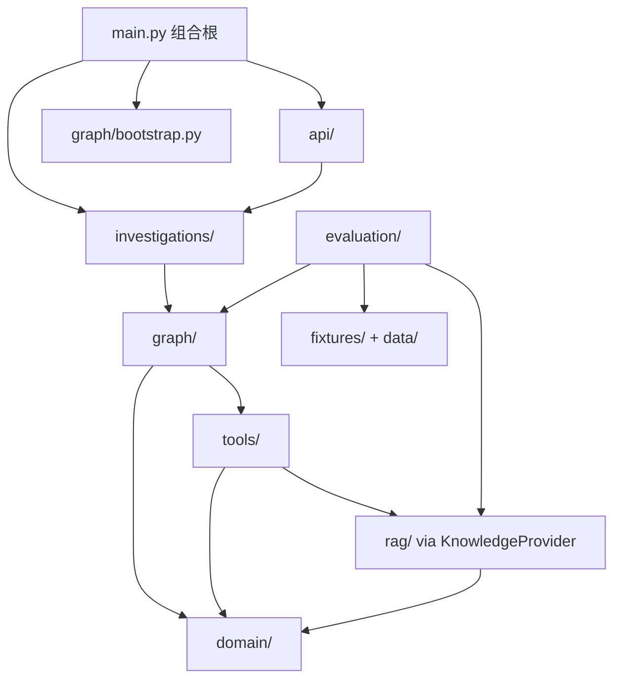

# 02 项目目录和模块关系

## 顶层目录

```text
incident-copilot/
├── src/incident_copilot/   Python 应用源码
├── tests/                  单元与集成测试
├── data/                   Fixture、知识库和评估集
├── scripts/                演示、索引、评估和图检查入口
├── docs/                   产品、架构、进度和教学文档
├── artifacts/              已提交的离线评估基线
├── deploy/                 Collector 与 Prometheus 配置
├── compose.yaml            本地容器编排
├── Dockerfile              应用镜像
├── pyproject.toml          依赖和质量工具配置
└── uv.lock                 精确依赖锁
```

项目采用 `src` layout。可导入包名仍是 `incident_copilot`, 而不是 `src.incident_copilot`。

## 源码模块职责

| 模块 | 主要职责 | 不应承担 |
| --- | --- | --- |
| `api/` | HTTP/SSE 协议转换 | 根因推理和 Provider 查询 |
| `core/` | 配置、日志、异常、Telemetry | Graph 控制流 |
| `domain/` | 领域值对象和不变量 | FastAPI/LangGraph 依赖 |
| `graph/` | State、节点、边、循环和模型端口 | 直接读文件或厂商 SDK |
| `tools/` | 工具 Schema、Registry、Provider 端口和 Adapter | 决定 Graph 路由 |
| `rag/` | 文档加载、切分、索引和检索 | 调查任务状态管理 |
| `investigations/` | 任务生命周期、事件、Repository、Checkpoint 装配 | Evidence 推理 |
| `evaluation/` | 数据集和离线指标 | 把标签注入 Graph |
| `fixtures/` | Fixture 外层 Schema | 真实数据访问 |

## 依赖方向



注意实际方向:

- `domain/` 不导入 FastAPI、LangGraph 或具体 Provider。
- `graph/nodes.py` 只调用注入的 `ToolRegistry` 和 `ModelProvider`。
- `rag/provider.py` 适配 `KnowledgeProvider`, 所以工具名不因 RAG 实现改变。
- `investigations/service.py` 可以启动 Graph, 但不实现节点推理。

## 数据分别放在哪里

| 数据 | 当前位置 |
| --- | --- |
| HTTP 请求 | Pydantic API Schema |
| 事故上下文 | `IncidentContext` |
| Graph 执行状态 | `InvestigationState` + Checkpointer |
| 任务状态 | `InvestigationRecord` + 当前内存 Repository |
| SSE 事件 | `InvestigationEvent` + 当前内存 Repository |
| 工具原始结果 | `Evidence`, 随后投影为 `EvidenceRef` |
| 知识文档 | `data/knowledge/*.md` |
| 评估标签 | `data/evaluation/incidents-v1.json` |

当前没有独立 Evidence Store。Graph State 保存有界 `EvidenceRef`, 并非只保存 Evidence ID。

## 测试目录怎么读

- `tests/unit/domain`: 验证领域不变量。
- `tests/unit/graph`: 验证 reducer、路由和 Fake Model。
- `tests/unit/tools`: 验证 Registry 和 Provider 边界。
- `tests/unit/rag`: 验证加载、切分、检索和向量 Adapter。
- `tests/integration/test_investigation_graph.py`: 验证完整 Graph 路径。
- `tests/integration/test_investigation_service.py`: 验证任务生命周期。
- `tests/integration/test_investigation_api_phase5.py`: 验证 HTTP/SSE/HITL。
- `tests/integration/test_offline_evaluation.py`: 验证评估隔离和产物。

下一步: [一次请求的完整生命周期](03-request-lifecycle.md)。
