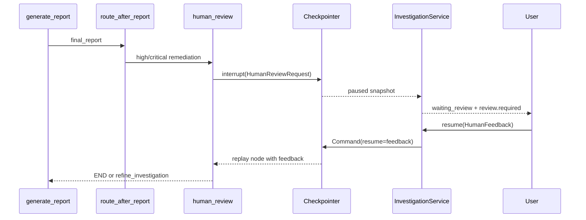

# 10 Checkpoint、Streaming 与 Human-in-the-loop

## 三个容易混淆的概念

| 概念 | 保存什么 | 当前后端 |
| --- | --- | --- |
| Checkpointer | Graph State 和执行位置 | Memory / PostgreSQL |
| InvestigationRepository | 任务记录和幂等关系 | In-memory |
| Event Repository | SSE 历史事件 | In-memory, 与任务 Repository 同实现 |

PostgreSQL Checkpointer 能恢复 Graph, 但不能自动恢复旧 SSE 历史或持久化幂等键。

## thread_id 与 run_id

```text
一个 investigation
└── 一个稳定 thread_id
    ├── initial run_id
    └── resume run_id
```

`thread_id` 是 checkpoint key。每次恢复使用同一个 thread, 但生成新的 run ID 供事件和可观测性区分。

## Checkpointer 装配

`open_checkpointer()` 在 FastAPI lifespan 中打开 saver:

- Memory: 无外部依赖, 进程结束即丢失。
- PostgreSQL: 动态导入可选 extra, 验证 DSN, 调用官方 saver `setup()`。

Graph 在 compile 时接收 saver。执行时还必须传:

```python
{"configurable": {"thread_id": thread_id}}
```

缺少 thread ID 会失去稳定恢复语义。

## HITL 暂停



`interrupt()` 之前不能执行不可重放副作用, 因为恢复会从节点开头重新执行。当前节点只构造审核请求, 没有发送邮件或执行修复。

## 接受与追加研究

### Accept

`human_review` 返回 Command:

```text
update human_feedback/review_completed
goto END
```

### Request more research

Service 先读取 checkpoint State 并检查剩余预算, 然后刷新 deadline, 通过 `Command(resume=feedback)` 恢复。节点写入反馈并跳转 `refine_investigation`。

同一调查有锁保护。第一次 resume 把状态从 waiting_review 改为 running, 第二次并发或重复请求会得到 409。

## Streaming

Service 使用 `graph.astream(..., stream_mode="updates")` 观察节点增量, 再投影为安全事件。SSE 路由不会直接输出这些内部 update。

事件具有:

- 稳定 event ID。
- 调查内单调 sequence。
- investigation/thread/run ID。
- occurred_at。
- 脱敏 data。

## Last-Event-ID

客户端断开后可发送最后 event ID。API 校验该 ID 必须属于当前 investigation, 再从其 sequence 之后读取。

当前事件在内存中, 所以只支持同一进程生命周期内重放。进程重建后 Graph checkpoint 可能存在, 旧事件列表仍会丢失。

## Heartbeat 和流结束

无新事件时 SSE 输出注释 heartbeat。以下状态关闭当前连接:

- waiting_review
- completed
- failed

waiting_review 只表示本次连接结束。人工恢复后, 客户端用最后 event ID 建立新连接即可继续。

## 生产化需要补什么

- 持久化 Investigation/Event Repository。
- 多实例事件广播。
- worker lease 和任务抢占。
- 慢消费者与事件保留策略。
- Checkpoint 连接池、断线和 HA 验证。

下一步: [Evaluation 与测试](11-evaluation-and-tests.md)。
